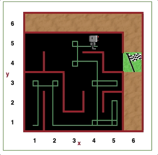

# Day 6
## Python Functions & Karel

## Exercises
- https://reeborg.ca/reeborg.html?lang=en&mode=python&menu=worlds%2Fmenus%2Freeborg_intro_en.json&name=Hurdle%201&url=worlds%2Ftutorial_en%2Fhurdle1.json
- https://reeborg.ca/reeborg.html?lang=en&mode=python&menu=worlds%2Fmenus%2Freeborg_intro_en.json&name=Hurdle%203&url=worlds%2Ftutorial_en%2Fhurdle3.json
- https://reeborg.ca/reeborg.html?lang=en&mode=python&menu=worlds%2Fmenus%2Freeborg_intro_en.json&name=Hurdle%204&url=worlds%2Ftutorial_en%2Fhurdle4.json

## Project: _Escape The Maze_

https://reeborg.ca/reeborg.html?lang=en&mode=python&menu=worlds%2Fmenus%2Freeborg_intro_en.json&name=Maze&url=worlds%2Ftutorial_en%2Fmaze1.json
